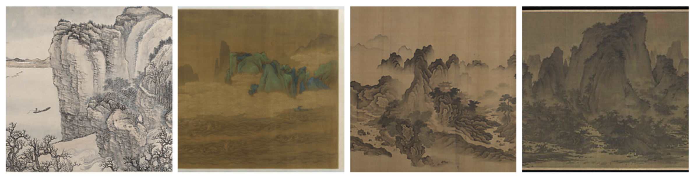
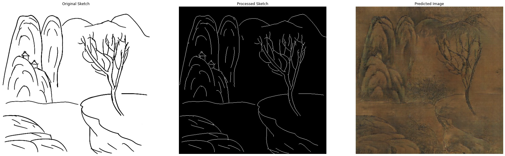
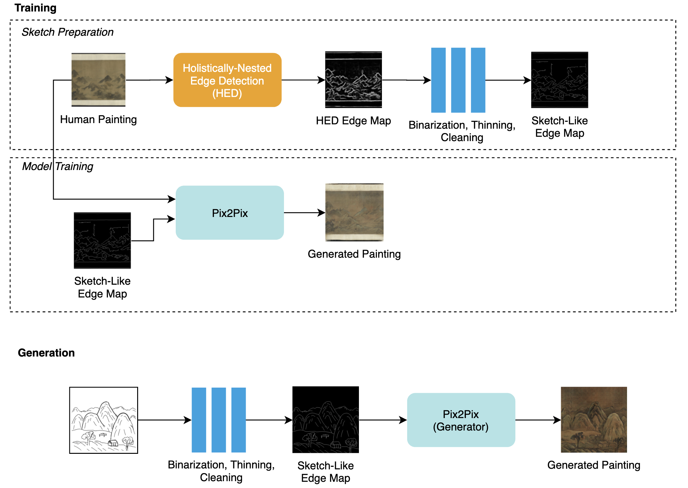

# Chinese Landscape Painting Stylization
This repo contains source code for training a Pix2Pix model that synthesizes Chinese landscape paintings from human-drawn sketches. Contents of synthesized paintings include mountains, rocks, trees, and houses. The model can also be used for applying style transfer to photos. 

## Example Training Data

## Example Model Outputs
### Sketch to Painting 

<!--  --> 

### Style Transfer

## Overall Technical Workflow

## Try it out on Colab
**Get your own paintings:**

**Train model:**

## Acknowledgements
- This project is a continuation of a [course project](https://github.com/Luxi-Zhao/sketch-to-Chinese-landscape-painting) done in collaboration with .
- Training data: [Chinese Landscape Painting Dataset](https://github.com/alicex2020/Chinese-Landscape-Painting-Dataset).
- Procedure for obtaining sketch-like edge maps was inspired by [Holistically-Nested Edge Detection](https://arxiv.org/abs/1504.06375) and [SketchyGAN](https://arxiv.org/abs/1801.02753).
- Pix2Pix model training: [TensorFlow tutorial](https://www.tensorflow.org/tutorials/generative/pix2pix).